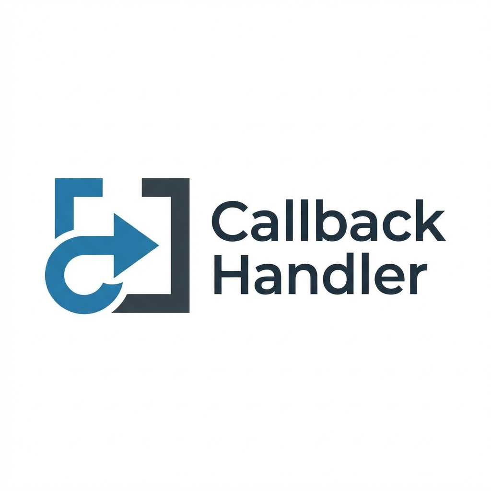
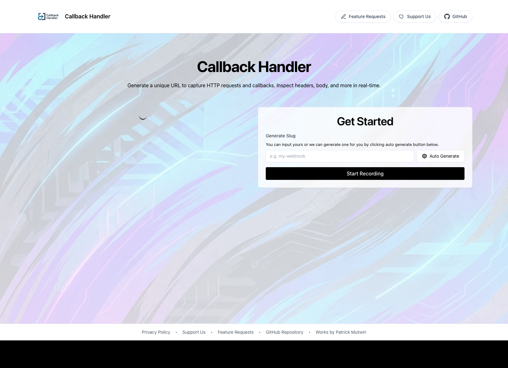
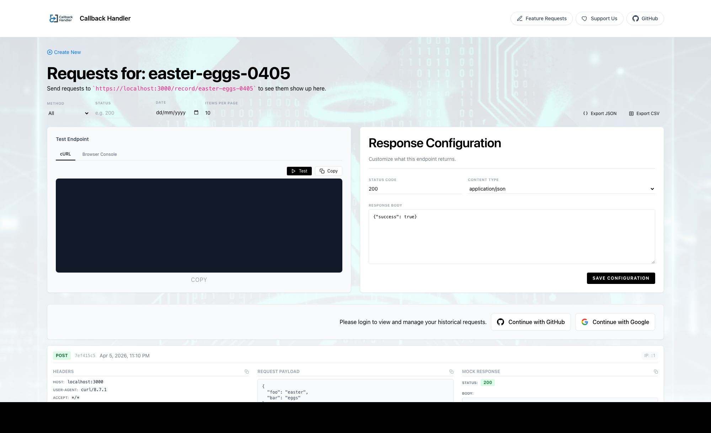
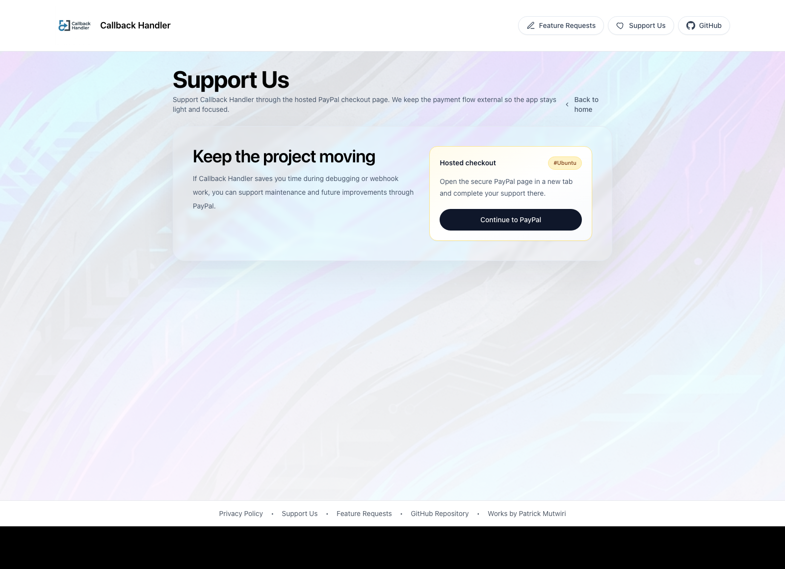
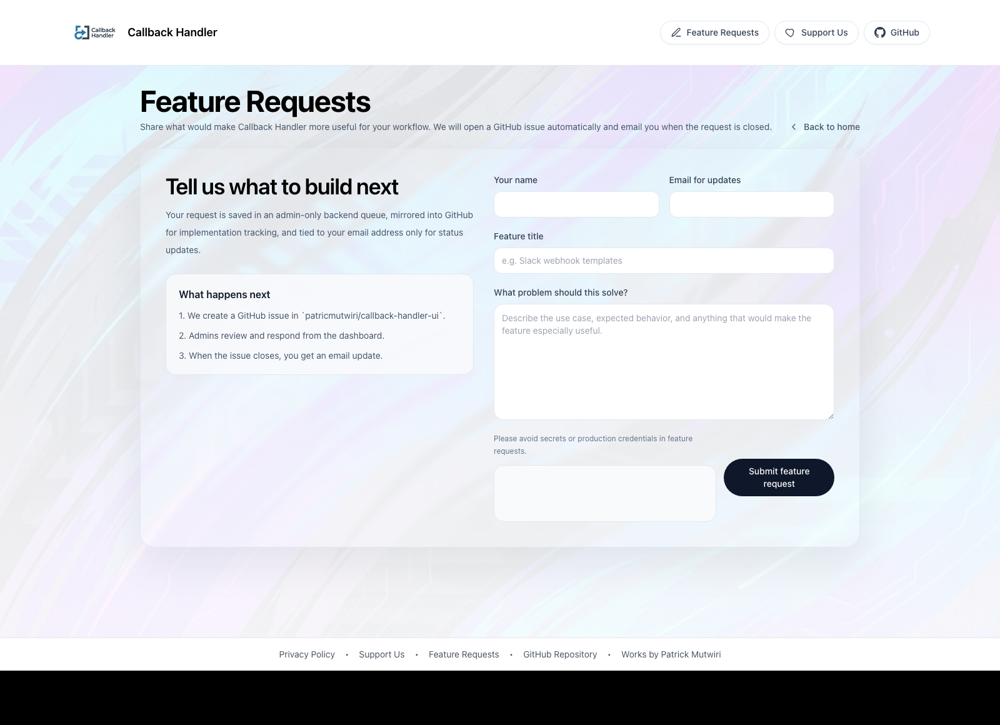

#  Callback Handler

Callback Handler helps you create unique URLs for receiving, inspecting, and debugging HTTP requests in real time.

It is built for webhook testing, callback inspection, request replay, quick endpoint sharing, and lightweight API debugging without needing to spin up a custom receiver every time.

Live service:
- [callback-handler-ui.vercel.app](https://callback-handler-ui.vercel.app)

## What You Can Do

- Create a custom or auto-generated slug
- Receive requests on a live endpoint
- Inspect headers, payloads, query params, IPs, and timestamps
- Test your endpoint directly from the UI
- Customize the response returned by the endpoint
- Export captured traffic as JSON or CSV
- Use the service as a guest or sign in for account-linked management
- View and manage your saved slugs
- Submit and track feature requests
- Support the project from the public support page

## Quick Tour

### Home



### Request Viewer



### Support



### Feature Requests



## How To Use The Service

## 1. Open the Home Page

Go to:

- [https://callback-handler-ui.vercel.app](https://callback-handler-ui.vercel.app)

From the top navigation you can access:

- `Feature Requests`
- `Support Us`
- `GitHub`

From the footer you can access:

- `Privacy Policy`
- `Support Us`
- `Feature Requests`

## 2. Create a Slug

A slug is the unique path segment that becomes your live request endpoint.

Example:

```text
https://callback-handler-ui.vercel.app/record/my-webhook-0405
```

You can create a slug in two ways:

- type your own slug
- click `Auto Generate`

The homepage automatically normalizes custom slugs into a safe URL format.

### Creating a Slug as a Guest

Guests do not need to sign in to start using the service.

Steps:

1. Open the homepage.
2. In `Get Started`, type a slug or click `Auto Generate`.
3. Click `Start Recording`.
4. You will be redirected to your live record page.

Important guest behavior:

- your browser is marked as the creator of that slug
- guest traffic is still logged
- guests can continue using the slug without creating an account
- guest viewers only see the most recent limited history in the UI
- older guest traffic is still retained for admins and internal tracking

### Creating a Slug as a Logged-In User

Signed-in users get a more persistent, account-linked workflow.

Steps:

1. Sign in from the homepage using the available provider.
2. Type a slug or generate one automatically.
3. Click `Start Recording`.
4. Visit the new record page.
5. The slug is associated with your account when ownership is available.

Benefits for signed-in users:

- your slugs appear on the dashboard
- you can revisit and manage them later
- you can request deletion with an audit trail
- you can access account-specific views like `My Slugs` and `My Feature Requests`

## 3. Send Requests to the Endpoint

Once your record page is open, your endpoint is live.

Example endpoint:

```text
https://callback-handler-ui.vercel.app/record/my-webhook-0405
```

You can now send requests from:

- `curl`
- Postman
- Insomnia
- your backend application
- third-party webhooks such as Stripe, Slack, GitHub, or custom services

### Example: JSON POST with curl

```bash
curl -X POST https://callback-handler-ui.vercel.app/record/my-webhook-0405 \
  -H "Content-Type: application/json" \
  -d '{"event":"user_signup","id":123}'
```

### Example: Form Submission

```bash
curl -X POST https://callback-handler-ui.vercel.app/record/my-webhook-0405 \
  -H "Content-Type: application/x-www-form-urlencoded" \
  -d "event=payment_succeeded&amount=1250"
```

### Example: Browser Console

```js
fetch('https://callback-handler-ui.vercel.app/record/my-webhook-0405', {
  method: 'POST',
  headers: {
    'Content-Type': 'application/json'
  },
  body: JSON.stringify({
    source: 'browser',
    test: true
  })
})
```

## 4. Inspect Requests

Every slug has its own request viewer page:

```text
/record/[slug]
```

On that page you can inspect:

- request method
- response status
- timestamp
- IP address
- query parameters
- headers
- request body
- returned response body

This is the core workflow for debugging incoming webhooks or callbacks.

## 5. Use Test Endpoint

The `Test Endpoint` section helps you quickly send sample requests to your own slug.

Available actions include:

- switching between `cURL` and `Browser Console`
- copying the request example
- running the request directly using the built-in `Test` action

This is useful when:

- you want to validate your slug before wiring a third-party integration
- you want to test response configuration changes
- you want to reproduce request shapes quickly

## 6. Customize the Response

The `Response Configuration` panel lets you control what the endpoint returns.

You can customize:

- status code
- content type
- response body

Example use cases:

- return `200 OK` with JSON
- simulate `202 Accepted`
- respond with custom text or XML
- test webhook retry behavior in other systems

## 7. View Slugs

Signed-in users can view their slugs from the dashboard.

Dashboard route:

- `/dashboard`

What you can do there:

- see all slugs linked to your account
- open each slug’s record page
- copy endpoint URLs
- see creation timestamps
- request slug deletion with a reason

Guests do not get the full `My Slugs` dashboard experience.

## 8. Request Slug Deletion

Signed-in users can request deletion for a slug from the dashboard.

How it works:

1. Open `My Slugs`.
2. Find the slug you want to remove.
3. Start a deletion request.
4. Enter the reason for deletion.
5. Submit the request.

Deletion behavior:

- a reason is required
- the deletion request is logged for admins
- deletion is delayed to allow reporting and audit workflows
- archives are staged before removal
- identifying user data is stripped in archived deletion staging

This is designed to preserve auditability while still allowing cleanup.

## 9. Feature Requests

Callback Handler includes a dedicated feature request flow.

Public page:

- `/feature-requests`

What users can do there:

- submit a feature title
- explain the use case
- leave an email for updates
- pass CAPTCHA verification

What happens after submission:

1. the request is saved in the backend
2. a GitHub issue is opened automatically
3. admins can review and respond
4. when the linked issue is closed, the requester can be notified

## 10. Track My Feature Requests

Signed-in users can track their own submitted feature requests.

Route:

- `/my-feature-requests`

This page shows:

- request title
- status
- admin response
- GitHub issue state
- update timestamps
- issue links when available

This gives requesters a proper follow-up flow instead of submitting ideas into a blind form.

## 11. Support the Project

The project includes a public support page.

Route:

- `/support`

Users can open the hosted support flow from there.

This keeps payments outside the main application experience while still giving people a clean way to contribute financially.

## 12. Privacy Policy

The public privacy page is available at:

- `/privacy`

It explains:

- what authentication data is collected
- what request data is captured
- retention expectations
- third-party services involved
- your rights and contact path

## Example Workflows

## Guest Workflow Example

Use this when you want to test a webhook quickly without signing in.

1. Open the homepage.
2. Create a slug like `quick-test`.
3. Click `Start Recording`.
4. Copy the endpoint URL.
5. Send a test request with `curl`.
6. Inspect the request on the record page.
7. Optionally change the response configuration.

## Logged-In Workflow Example

Use this when you want persistent management and tracking.

1. Sign in.
2. Create a slug.
3. Send real traffic to it.
4. View the slug in the dashboard later.
5. Export requests if needed.
6. Request deletion when the slug is no longer needed.
7. Track your feature requests from your account page.

## Third-Party Webhook Workflow Example

Use this when testing an external integration.

1. Create a slug.
2. Copy the full endpoint URL.
3. Paste it into the third-party provider’s webhook settings.
4. Trigger an event from that provider.
5. Open the record page and inspect:
   - headers
   - payload
   - response code returned
6. adjust the response configuration if the provider expects a different reply
7. trigger the external event again and compare results

## Practical Examples

## Capture a Stripe-Like Event

```bash
curl -X POST https://callback-handler-ui.vercel.app/record/stripe-debug-0405 \
  -H "Content-Type: application/json" \
  -d '{
    "type":"payment_intent.succeeded",
    "data":{"object":{"id":"pi_123","amount":2500}}
  }'
```

## Capture GitHub-Style JSON

```bash
curl -X POST https://callback-handler-ui.vercel.app/record/github-debug-0405 \
  -H "Content-Type: application/json" \
  -H "X-GitHub-Event: push" \
  -d '{
    "ref":"refs/heads/main",
    "repository":{"full_name":"patricmutwiri/callback-handler-ui"}
  }'
```

## Simulate a Temporary Accepted Response

On the record page set:

- Status code: `202`
- Content type: `application/json`
- Response body:

```json
{"accepted":true}
```

Then send a test request again and verify the caller gets the updated response.

## Local Development

If you want to run the service locally:

1. Clone the repo.
2. Install dependencies.
3. Set environment variables.
4. Run the dev server.

```bash
git clone https://github.com/patricmutwiri/callback-handler-ui.git
cd callback-handler-ui
npm install
npm run dev
```

Then open:

- [http://localhost:3000](http://localhost:3000)

## Environment Notes

The application uses external services depending on enabled flows.

Examples include:

- Vercel KV
- NextAuth providers
- Pusher
- SMTP
- GitHub issue creation
- Turnstile CAPTCHA

If you are self-hosting, make sure all required environment variables are configured for the features you want to use.

## Who This Is For

Callback Handler is useful for:

- backend developers
- frontend developers integrating webhooks
- QA teams testing callbacks
- DevOps and platform engineers validating outbound integrations
- indie hackers and product builders debugging automations

## Support and Links

- App: [callback-handler-ui.vercel.app](https://callback-handler-ui.vercel.app)
- Feature Requests: [callback-handler-ui.vercel.app/feature-requests](https://callback-handler-ui.vercel.app/feature-requests)
- Support: [callback-handler-ui.vercel.app/support](https://callback-handler-ui.vercel.app/support)
- Privacy: [callback-handler-ui.vercel.app/privacy](https://callback-handler-ui.vercel.app/privacy)
- Repository: [github.com/patricmutwiri/callback-handler-ui](https://github.com/patricmutwiri/callback-handler-ui)

## Contributing

If you find a bug, have a product idea, or want to improve the service:

- open an issue
- submit a feature request from the app
- contribute through GitHub
- support the project from the support page

## Final Notes

Callback Handler is built to make request debugging simple:

- create a slug
- send traffic
- inspect what arrived
- adjust the response
- repeat until your integration works

That makes it a fast tool for day-to-day webhook and callback troubleshooting.

Made with ❤️ for us by us.
